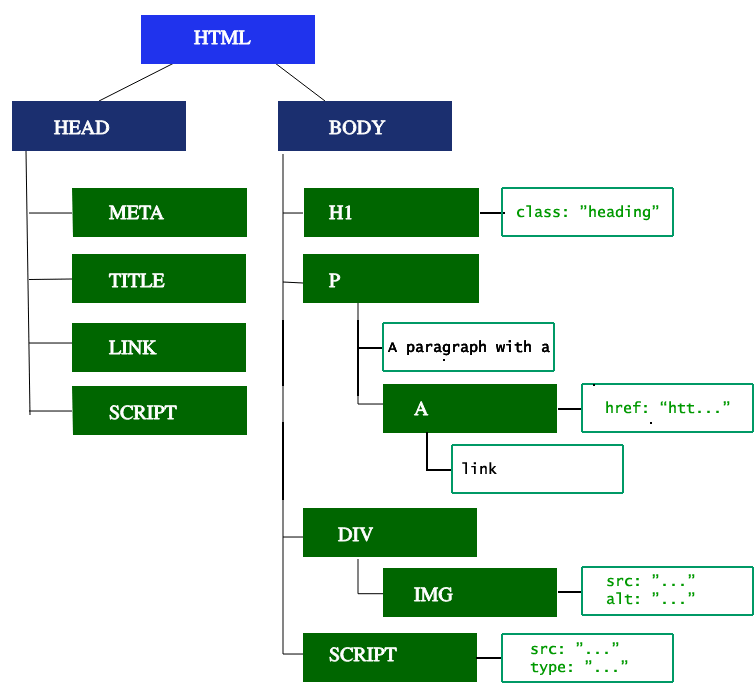
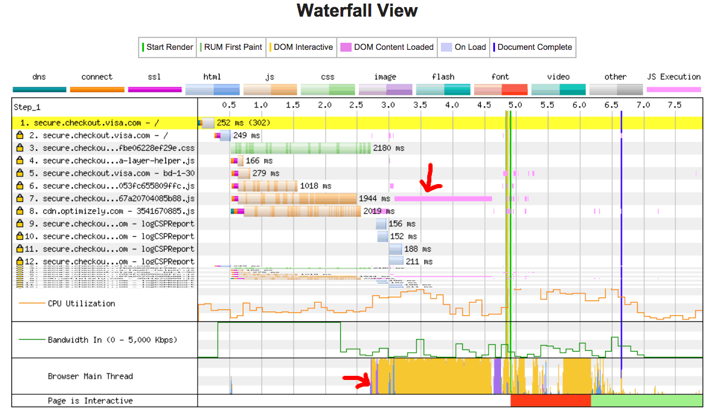

## Browsers and how they work

### Table of contents
1. [Overview](#overview)
2. [Navigation](#navigation)
   - [DNS Lookup](#dns-lookup)
   - [TCP Handshake](#tcp-handshake)
   - [TLS Negotiation](#tls-negotiation)
3. [Response](#response)
   - [Congestion control / TCP slow start](#congestion-control--tcp-slow-start)
4. [Parsing](#parsing)
   - [Building the DOM tree](#building-the-dom-tree)
   - [Preload scanner](#preload-scanner)
   - [Building the CSSOM tree](#building-the-cssom-tree)
   - [Other processes](#other-processes)
     - [JavaScript compilation](#javascript-compilation)
     - [Building the accessibility tree](#building-the-accessibility-tree)
5. [Render](#render)
   - [Style](#style)
   - [Paint](#paint)
   - [Compositing](#compositing)
6. [Interactivity](#interactivity)

### Overview
Making websites load quickly is crucial for a good user experience. There are two main issues to tackle: latency, which is the time it takes for data to travel between devices, and the fact that browsers typically handle tasks one at a time.

Latency is a big challenge for fast-loading pages. Developers aim to make sites load as fast as possible, considering the time it takes for data to travel through networks. Browsers usually handle tasks one after the other, and for smooth interactions like scrolling or responding to touch, developers focus on making sure the main task is done quickly so the website is responsive.

In a nutshell, the goal is to make websites load fast and respond quickly to user actions by understanding and optimizing how browsers handle tasks.

### Navigation
When you want to open a web page by typing a website address, clicking a link, or submitting a form, that's called **navigation**. Making this step fast is a goal for a smooth web experience. Normally, it's quick, but things like delays caused by slow connections or limited data can slow it down. So, making navigation fast is an aim for better performance on the web.

#### DNS Lookup


When you want to visit a website, the first thing your browser does is find where the website's information is stored. For example, if you go to https://example.com, your browser needs to figure out the location of the webpage on a server, identified by an IP address like 93.184.216.34. This is done through a process called DNS lookup.

Your browser asks a name server to find the IP address for the website. Once found, this information is often stored temporarily to speed up future visits. However, if a webpage uses different locations for its fonts, images, scripts, ads, and metrics, your browser might need to do separate DNS lookups for each one, which can take a bit of time.

#### TCP Handshake
When your browser knows the location of a website (its IP address), it connects to the server using a process called TCP three-way handshake. This is like a friendly introduction between your browser and the web server before they start sharing data, especially if it's done securely with HTTPS.

This handshake involves three messages, often called "SYN-SYN-ACK." It's a way for your browser and the server to agree on how they will communicate. So, even before your request is sent, there are three messages going back and forth to set up the connection.

#### TLS Negotiation


When your browser wants to connect to a website securely using HTTPS, it goes through an additional process called TLS handshake. This involves figuring out how to encrypt the communication, confirming the server's identity, and ensuring a secure connection. This step takes five more rounds of communication with the server before your actual request for content is sent.

So, before your browser can ask for the website's information, there are three steps: DNS lookup, TCP handshake, and TLS handshake involving five more steps. While this adds some time, having a secure connection is important because it protects the information being sent between your browser and the server from being understood by outsiders. After these eight rounds, your browser is finally ready to make the request for the webpage.

### Response

```
<!doctype html>
<html lang="en-US">
  <head>
    <meta charset="UTF-8" />
    <title>My simple page</title>
    <link rel="stylesheet" href="styles.css" />
    <script src="myscript.js"></script>
  </head>
  <body>
    <h1 class="heading">My Page</h1>
    <p>A paragraph with a <a href="https://example.com/about">link</a></p>
    <div>
      
    </div>
    <script src="anotherscript.js"></script>
  </body>
</html>

```

Once your browser is connected to a web server, it asks for the main part of a website (usually an HTML file) by sending a request. The server then responds with information about the content and the actual HTML. The ["Time to First Byte" (TTFB)](https://developer.mozilla.org/en-US/docs/Glossary/Time_to_first_byte) measures the time between when you clicked a link and when the first piece of website data arrives. In this case, it's typically the first 14KB of the webpage. Even though the initial request is usually smaller than 14KB, additional parts like images are requested later as your browser reads and understands the webpage.


#### Congestion control / TCP slow start
When data is sent over the internet, it's broken into TCP packets. To make sure everything arrives in the correct order, the server needs to get an acknowledgment (ACK) from the client after sending a certain number of these packets.

If the server waits for an ACK after every packet, it might take too long. But if it sends too many packets at once, the client might struggle to keep up, leading to delays.

To balance this, TCP uses [the slow start algorithm](https://developer.mozilla.org/en-US/docs/Glossary/TCP_slow_start). It gradually increases the amount of data sent until it finds the maximum speed the network can handle. If the ACK is received, more data can be sent next time. If not, the amount of data sent is reduced. This way, TCP finds a balance between sending too much and sending too little, making internet communication more efficient.

### Parsing
Once your browser gets the first piece of data from the server, it starts turning that data into something it can use to display the webpage. This process is called parsing, and it creates the [DOM (Document Object Model)](https://developer.mozilla.org/en-US/docs/Glossary/DOM) and [CSSOM (CSS Object Model)](https://developer.mozilla.org/en-US/docs/Glossary/CSSOM), which the browser's renderer uses to show the page on your screen.

The DOM is like the browser's internal version of the webpage's structure. It can also be changed using JavaScript. Even if the whole webpage is larger than the initial 14KB, the browser begins parsing and tries to show a basic version of the page based on the data it has. For faster page loading, it's essential to include the necessary HTML and CSS in the first 14KB so that the browser can start displaying the page or at least a basic template. However, nothing appears on the screen until the HTML, CSS, and JavaScript are fully parsed.

#### Building the DOM tree


The critical rendering path involves [five steps](https://developer.mozilla.org/en-US/docs/Web/Performance/Critical_rendering_path). First, the browser processes the HTML markup and creates the DOM tree, which describes the document's content. The HTML is tokenized, and well-formed documents are parsed faster. The DOM tree reflects the relationships between elements, with the <html> element being the root.

When the parser found the non-blocking resources like images, the browser continues parsing while requesting those resources. However, \<script> elements, especially without async or defer attributes, can block rendering and pause HTML parsing. Excessive scripts, even with the browser's preload scanner, can still slow down this process.

#### Preload scanner

While the browser is creating the DOM tree, it uses the main thread for this task. At the same time, the preload scanner identifies important resources like CSS, JavaScript, and web fonts and starts requesting them. This means we don't have to wait for the parser to find a reference to a resource before requesting it; the resources are fetched in the background. By the time the main HTML parser reaches these assets, they might already be on their way or downloaded, reducing delays.

```
<link rel="stylesheet" href="styles.css" />
<script src="myscript.js" async></script>

<script src="anotherscript.js" async></script>
```

For example, in the given code snippet, the preload scanner identifies the scripts and image while the main thread processes HTML and CSS, and begins downloading them early. To prevent scripts from causing delays, the `async` (or `defer`) attribute is used. Waiting for CSS doesn't block HTML parsing or downloading, but it can block JavaScript because JavaScript often depends on CSS properties.

#### Building the CSSOM tree
In the critical rendering path, the second step is dealing with CSS. It involves creating something called the CSSOM tree, which is similar to the DOM tree we talked about earlier. Both the DOM and CSSOM are like trees, but they are separate structures. The browser takes the CSS rules it receives and turns them into a map of styles it can understand. This process is pretty fast and isn't specifically highlighted in developer tools.

To build the CSSOM tree, the browser looks at the CSS rules, starting with the most general ones and refining the styles by applying more specific rules. This is called cascading the property values. While building the CSSOM is quick, it's not typically displayed distinctly in developer tools. Instead, the "Recalculate Style" in developer tools shows the total time it takes to process CSS, construct the CSSOM tree, and calculate styles. Generally, creating the CSSOM takes less time than something like a DNS lookup in terms of web performance optimization.

#### Other processes
##### Javascript compilation
While the browser is working on the CSS, it's also downloading other stuff like JavaScript files (thanks to the preload scanner). Then, it processes the JavaScript, turning it into something it can understand. The scripts are transformed into [abstract syntax trees](https://en.wikipedia.org/wiki/Abstract_Syntax_Tree), kind of like a structure that represents the code. Some browsers then use a compiler to turn these trees into bytecode, which is a set of instructions the computer can execute.

Most of the time, this JavaScript code is interpreted on the main thread, meaning it's understood and executed step by step. However, there are cases, like code running in [web workers](https://developer.mozilla.org/en-US/docs/Web/API/Web_Workers_API), where things work a bit differently.

##### Building the accessibility tree
The browser creates something called an [accessibility tree](https://developer.mozilla.org/en-US/docs/Learn/Accessibility), which is like a special version of the DOM designed to help devices like screen readers understand and interpret content for people who might have difficulty seeing or using a screen. This accessibility object model (AOM) is like a semantic version of the regular DOM.

Whenever the normal DOM gets updated, the accessibility tree gets updated too. It's important because until this accessibility tree is built, the content isn't accessible to [screen readers](https://developer.mozilla.org/en-US/docs/Web/Accessibility/ARIA/ARIA_Screen_Reader_Implementors_Guide) or other assistive technologies that people might be using.

### Render
When a webpage is being shown on your screen, it goes through a few steps: style, layout, paint, and sometimes compositing. First, the CSSOM and DOM trees, created earlier, are combined into something called a render tree. This tree is used to figure out how every visible part of the webpage should be arranged on the screen.

Once the layout is sorted out, the browser paints the webpage onto the screen. In some cases, parts of the content can be separated and painted on a different layer, which helps make things faster. This is because these separate layers can be handled by the graphics processor (GPU) instead of the main processor (CPU), freeing up the main thread for other tasks and improving performance.

#### Style
In the critical rendering path, the third step involves combining the DOM and CSSOM into something called a render tree. This process starts with the root of the DOM tree and goes through each visible element.

Elements that won't be shown, like the <head> element and its children or nodes with display: none, won't be included in the render tree. However, nodes with visibility: hidden are included because they still take up space even if you can't see them. Each visible element gets its CSS styles applied. The render tree contains all the visible elements with their content and computed styles, matching up the relevant styles for every visible element in the DOM tree. This helps determine how each element should look based on the [CSS](https://developer.mozilla.org/en-US/docs/Web/CSS/Cascade) rules.

#### Layout
In the critical rendering path, the fourth step is layout, where the browser figures out the size and position of all the elements on the page. This process involves determining the dimensions and location of each node in the render tree, including the size and position of every object.

After the render tree is built, layout starts from the top and goes through all the elements, turning the identified nodes and styles into actual dimensions and positions on the screen. On a webpage, everything is considered as a box, and considering different device sizes and user preferences, the browser decides how big each box should be. The initial determination of size and position is called layout, and any subsequent adjustments are called reflows.

For example, if there's an image without declared dimensions, a reflow happens once the browser knows the image's size. The browser initially creates a placeholder and then adjusts the layout once the image dimensions are known.

#### Paint
The final step in getting a webpage ready to show is painting, where the browser turns the calculated layout of elements into actual pixels on the screen. The first time this happens is called the first meaningful paint. During painting, the browser quickly draws everything on the screen, including text, colors, borders, shadows, and elements like buttons and images.

For smooth scrolling and animations, all tasks on the main thread, like calculating styles, reflow, and paint, must be done in less than 16.67 milliseconds. For example, an iPad screen has over 3 million pixels to paint, and this needs to be done super fast. To make painting even faster, it's often broken down into layers. These layers help with repaint performance, and certain elements, like \<video> or elements with specific CSS properties, can be promoted to their own layer. While layers improve performance, they use up memory, so it's important not to overuse them in web performance strategies.

#### Compositing
When different parts of a webpage are drawn on separate layers and they overlap, compositing is needed to make sure they appear correctly on the screen in the right order.

As the page keeps loading, things like late-arriving images can cause reflows, which trigger a repaint and a re-composite. If we had defined the dimensions of our image beforehand, there wouldn't be a reflow, and only the necessary layer would be repainted and composited if needed. But since we didn't include the image dimensions, when the image arrives, the rendering process goes back to the layout steps and starts over from there.

### Interactivity


After the main thread finishes painting the webpage, it might not be immediately ready for user interactions, especially if there's JavaScript involved. If JavaScript is correctly deferred and only runs after the onload event, the main thread may be busy with parsing, compiling, and executing it. Time to Interactive (TTI) measures how long it takes for the page to become interactive after the first request.

In simpler terms, if the main thread is busy with JavaScript tasks, the page won't respond quickly to user interactions. For example, even if the page loads quickly, a large JavaScript file might take a while to download, making scrolling or other actions unresponsive until the script is fully processed. This can lead to a poor user experience. It's essential to avoid keeping the main thread occupied with lengthy JavaScript tasks to ensure a smoother interaction for users.