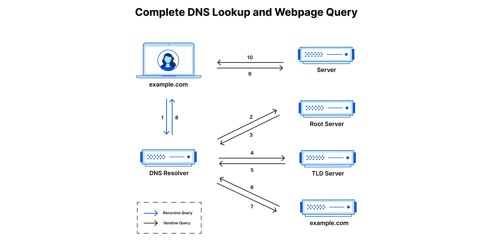

## DNS and how it works?

### Table of contents
1. [What is DNS?](#what-is-dns)
2. [How does DNS work?](#how-does-dns-work)
3. [There are 4 DNS servers involved in loading a webpage](#there-are-4-dns-servers-involved-in-loading-a-webpage)
4. [What's the difference between an authoritative DNS server and a recursive DNS resolver?](#whats-the-difference-between-an-authoritative-dns-server-and-a-recursive-dns-resolver)
5. [A CNAME Record](#a-cname-record)
6. [What are the steps in a DNS lookup?](#what-are-the-steps-in-a-dns-lookup)
7. [What are the types of DNS queries?](#what-are-the-types-of-dns-queries)
8. [What is DNS caching? Where does DNS caching occur?](#what-is-dns-caching-where-does-dns-caching-occur)

### What is DNS
The Domain Name System (DNS) is like the phonebook of the Internet. When we use names like nytimes.com or espn.com to access websites, the DNS translates these names into unique IP addresses that computers can understand. Each device connected to the Internet has its own special IP address, which is like its online address. DNS servers make it easier for us because we don't have to remember these numerical IP addresses, and instead, we can use familiar names to access websites.

### How does DNS work
DNS resolution is the process of turning a user-friendly website name (like www.example.com) into a computer-friendly IP address (like 192.168.1.1). Every device on the Internet has a unique IP address, and this address is crucial for locating the right device, similar to how a street address helps find a specific home.

When you want to load a webpage, there needs to be a translation between what you type into your web browser (like example.com) and the machine-friendly address needed to locate that webpage.

The DNS resolution happens behind the scenes in your web browser, and you don't need to interact with it apart from making the initial request. It involves passing through different hardware components to find and translate the IP address associated with the website you want to visit.

### There are 4 DNS servers involved in loading a webpage:

Imagine the DNS system like a library, and different parts of it play specific roles:
1. **DNS Recursor (Librarian):**
   - Role: Like a librarian searching for a specific book in a library.
   - Function: Receives queries from applications (e.g., web browsers) and works to find the requested information.
   - Action: Makes additional requests to fulfill the client's DNS query.

2. **Root Nameserver (Library Index):**
   - Role: Like an index in a library pointing to different sections.
   - Function: The first step in translating human-readable names into IP addresses.
   - Action: Serves as a reference to more specific locations, guiding the search for the right information.

3. **TLD Nameserver (Specific Rack of Books):**
   - Role: Like a specific rack of books in the library.
   - Function: The next step in finding a specific IP address, hosting the last part of a hostname (e.g., "com" in example.com).

4. **Authoritative Nameserver (Dictionary on a Rack):**
   - Role: Like a dictionary on a rack of books.
   - Function: The final stop in the nameserver query.
   - Action: If it has the information, it translates a specific name into its definition and returns the IP address to the DNS Recursor that initiated the request.

### What's the difference between an authoritative DNS server and a recursive DNS resolver?
In the world of DNS, there are two important types of servers: **recursive resolver** and **authoritative nameserver**. They play distinct roles and are positioned at different stages in the process of a DNS query. 

- **Recursive Resolver (Beginning of the DNS Query):**
  - Role: Acts like the starting point of a DNS query, handling requests from applications (like web browsers).
  - Function: Goes through the DNS pipeline, making additional requests if needed to find the requested information.
  - Think of it like the first step in finding something in a library.
  

- **Authoritative Nameserver (End of the DNS Query):**
  - Role: Serves as the final stop in the DNS query process.
  - Function: Holds specific information about a requested hostname and provides the ultimate answer.
  - Think of it like the last source you check to get the exact information you need.
  

So, in simple terms, the recursive resolver kicks off the search, and the authoritative nameserver gives the final, authoritative answer. They work together to ensure your web browser finds the correct IP address for the website you want to visit.

#### A CNAME record
A CNAME (Canonical Name) record like a nickname or an alias for a website. It's a way to give a website multiple names that all lead to the same place.

Here's a simple analogy:

Think of a famous person, let's say a musician, who has a real name and a cool stage name. The real name might be like the actual technical address of a website (let's call it "www.realname.com"). Now, the stage name is like the CNAME record – it's another name (let's say "www.stagename.com") that people can use to get to the same musician.

So, when you type in "www.stagename.com" into your browser, it's like using the CNAME record to reach the same website as "www.realname.com." It's a way to have different addresses that all point to the same online destination, making things easier for people to find and remember.

### What are the steps in a DNS lookup?
let's break down the DNS lookup process:

1. **User Input:**
   - A user types 'example.com' into a web browser.

2. **DNS Recursive Resolver:**
   - The query goes to a DNS recursive resolver (like a guide) in the Internet.

3. **Root Nameserver:**
   - The resolver asks a DNS root nameserver for information.
  
4. **TLD DNS Server:**
   - The root server directs the resolver to a Top Level Domain (TLD) DNS server (like '.com').

5. **TLD Response:**
   - The TLD server provides the IP address of the domain's nameserver (example.com).

6. **Domain's Nameserver:**
   - The resolver queries the domain's nameserver.

7. **IP Address Returned:**
   - The TLD server responds with the IP address of example.com.

8. **Resolver Response:**
   - The DNS resolver gives the web browser the IP address.

Now, the browser can make the actual request:

9. **HTTP Request:**
   - The browser sends an HTTP request to the IP address.

10. **Webpage Returned:**
    - The server at that IP returns the webpage to be shown in the browser.

Remember, these steps might be quicker if some information is already stored (cached) locally or remotely. It's like asking for directions – if you've been there before, you might not need to ask all the steps again!

### What are the types of DNS queries?
Let's understand the three types of DNS queries:

1. **Recursive Query:**
   - Think of it like asking a knowledgeable friend for directions to a specific place.
   - The DNS client (your computer) asks a DNS server (usually a DNS recursive resolver) to find the requested information.
   - The server either provides the needed information or says it can't find it.

2. **Iterative Query:**
   - Imagine you're asking for directions, and if someone doesn't know, they point you to the next person who might.
   - The DNS client allows the DNS server to provide the best answer it has.
   - If the queried server doesn't have the information, it refers (points) the client to another DNS server lower down in the domain hierarchy.
   - This process continues until the information is found or a limit is reached.

3. **Non-Recursive Query:**
   - Picture asking a specific person who you know has the answer, like a local expert.
   - The DNS resolver client asks a DNS server for information it already has access to.
   - This happens because the server is authoritative for the record (like being an expert on a topic) or the record is in its cache (like having remembered information).
   - This helps in saving bandwidth and reducing load on higher-level servers.

These types of queries help optimize the process of finding information on the internet efficiently.

### What is DNS caching? Where does DNS caching occur?
Let's break down DNS caching:

**DNS Caching - Making Internet Faster:**

1. **Purpose of Caching:**
   - Caching is like saving important information closer to you so you can get it quickly when needed.
   - DNS caching is a way to store data (like website addresses) nearby, so your computer doesn't have to go far to find them, making the internet faster.

2. **How DNS Caching Works:**
   - Imagine having a small notebook to jot down addresses you frequently visit. DNS caching is a bit like that notebook.
   - Modern web browsers and your computer's operating system keep a list of website addresses (DNS records) for a certain time.
   - This way, when you visit a site, your computer first checks its "notebook" (DNS cache) to see if it already knows the address. If yes, it saves time.

3. **Browser DNS Caching:**
   - Your web browser (like Chrome) automatically saves website addresses in its cache.
   - This cache is checked first when you want to visit a site. If the address is there, great! If not, it goes to the next step.

4. **Operating System (OS) Level DNS Caching:**
   - Your computer has its own "notebook" (OS DNS cache) for website addresses.
   - Before going outside your computer, it checks this cache. If it finds the address, perfect! If not, it goes to the next step.
   - It then talks to a special server (DNS recursive resolver) provided by your internet provider (ISP), which is like asking someone who knows a lot about addresses.

5. **Recursive Resolver Magic:**
   - The DNS resolver checks its own "notebook" (cache) to see if it knows the address. If yes, great! If not, it does a bit of detective work.
   - Depending on what it knows, it may directly ask the authoritative nameservers (like experts) for the address or take shortcuts to speed things up.

**Why is DNS Caching Important?**
   - Saves time: Reduces the steps your computer takes to find website addresses.
   - Faster Internet: Helps websites load quickly by avoiding unnecessary delays.
   - Efficient Use: Ensures your computer doesn't repeatedly ask for the same information, saving bandwidth.

So, DNS caching is like having a smart friend who remembers addresses, making your internet experience smoother and faster.